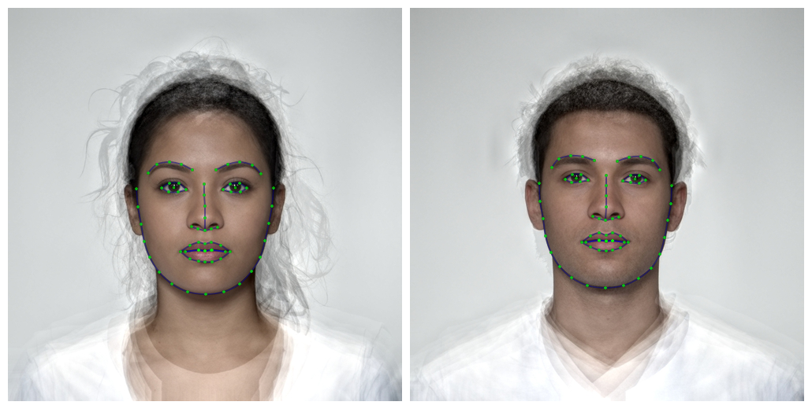
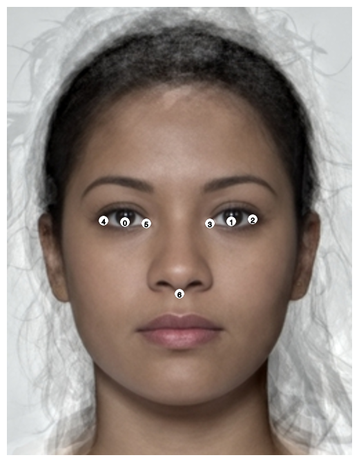

<!-- README.md is generated from README.Rmd. Please edit that file -->

# webmorphR.dlib

<!-- badges: start -->

[](https://codecov.io/gh/debruine/webmorphR.dlib?branch=main)
[](https://lifecycle.r-lib.org/articles/stages.html#experimental)
<!-- badges: end -->

This package provides dlib shape models and scripts for use with the
package [webmorphR](https://debruine.github.io/webmorphR/). These files
are used for different auto-delineations with python (although I may
change this to use dlib in C++ directly). It also provides (very
experimental) functions for [training shape
models](articles/facetrain.html).

## Installation

You can install the development version of webmorphR.dlib from
[GitHub](https://github.com/) with:

``` r
# install.packages("remotes")
remotes::install_github("debruine/webmorphR.dlib")
```

Now load the webmorphR package (it’s installed with webmorphR.dlib) and
check if you can use the auto-delineation function.

``` r
library(webmorphR)
#> 
#> ************
#> Welcome to webmorphR. For support and examples visit:
#> https://debruine.github.io/webmorphR/
#> ************

# load demo images and delineate
stim_70_point <- demo_stim() |> 
  auto_delin(model = "dlib70",
             replace = TRUE)

# plot with template points
draw_tem(stim_70_point) |> plot()
```



If this doesn’t work, you probably need to sort out your python
installation.

``` r
reticulate::install_python()
```

The `auto_delin()` function will load the required python modules. If
you get errors about that, you may need to install cmake and dlib first.
I found these instructions useful for [dlib installation on a
mac](https://stackoverflow.com/questions/54719496/how-to-install-dlib-for-python-on-mac).

## Templates

### dlib7

This is the 5-point template from Davis King’s
[shape_predictor_5\_face_landmarks.dat](https://github.com/davisking/dlib-models#shape_predictor_5_face_landmarksdatbz2)
trained on 7198 faces from the [dlib 5-point face landmark
dataset](http://dlib.net/files/data/dlib_faces_5points.tar). I added two
points for the eye centres (0 and 1) in order to aid alignment by eyes.

It’s a very fast auto-delineation and useful if you just need to align
faces to the same position, orientation or general size.



### dlib70


This is the 68-point template from Davis King’s
[shape_predictor_68_face_landmarks.dat](https://github.com/davisking/dlib-models#shape_predictor_68_face_landmarksdatbz2)
trained on the [iBUG 300-W
dataset](https://ibug.doc.ic.ac.uk/resources/facial-point-annotations/).
I added two points for the eye centres (0 and 1) in order to aid
alignment by eyes.

> C. Sagonas, E. Antonakos, G, Tzimiropoulos, S. Zafeiriou, M. Pantic.
> 300 faces In-the-wild challenge: Database and results. Image and
> Vision Computing (IMAVIS), Special Issue on Facial Landmark
> Localisation “In-The-Wild”. 2016.

The license for this dataset excludes commercial use, so the trained
model can not be used in a commercial product.
