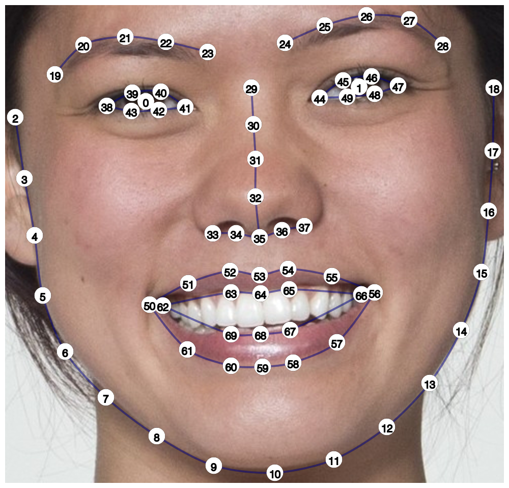

# webmorphR.dlibs

This package provides dlib files for use with the package [webmorphR](https://debruine.github.io/webmorphR/). These files are used for different auto-delineations with the python module [face_recognition](https://github.com/ageitgey/face_recognition). 

## Install the package

``` r
remotes::install_github("debruine/webmorphR.dlibs")
```

## dlib70



This is the 68-point template from Davis King's [shape_predictor_68_face_landmarks.dat](https://github.com/davisking/dlib-models#shape_predictor_68_face_landmarksdatbz2) trained on the [iBUG 300-W dataset](https://ibug.doc.ic.ac.uk/resources/facial-point-annotations/). I added two points for the eye centres (0 and 1) in order to aid alignment by eyes.

> C. Sagonas, E. Antonakos, G, Tzimiropoulos, S. Zafeiriou, M. Pantic. 300 faces In-the-wild challenge: Database and results. 
Image and Vision Computing (IMAVIS), Special Issue on Facial Landmark Localisation "In-The-Wild". 2016.

The license for this dataset excludes commercial use, so the trained model can not be used in a commercial product. 


